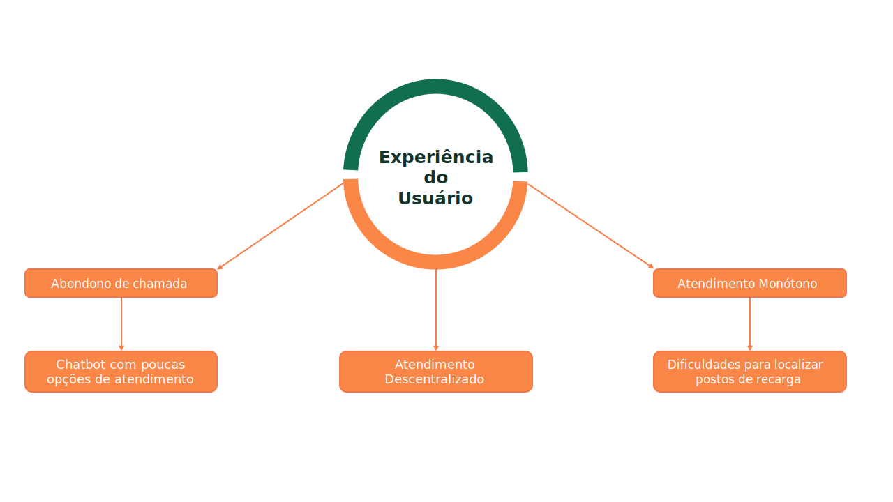
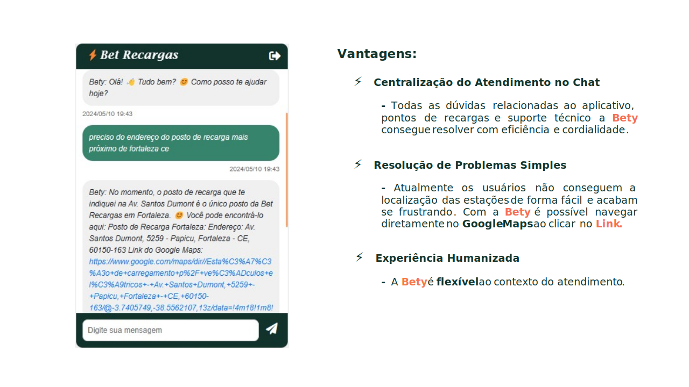
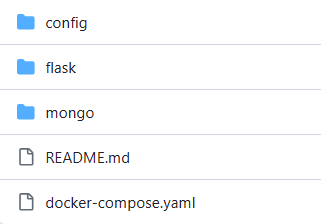
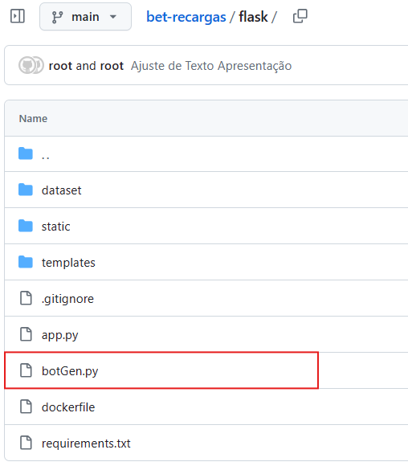

# Atendimento Personalizado

## Introdução

No contexto de uma sociedade em constante evolução, a busca por soluções sustentáveis tornou-se uma necessidade global. Nesse cenário dinâmico, a Bet Recargas emerge como uma peça-chave na transformação do panorama automotivo brasileiro. Com uma visão orientada para o futuro e um compromisso inabalável com a inovação e a sustentabilidade.

## Objetivo do Projeto

Viabilizar uma experiência personalizada no atendimento ao cliente. 

Para garantir a execução deste projeto, foi utilizado elementos de páginas na construção de um MVP (Produto Mínimo Viável) integrado ao modelo Gemini 1.5 Pro contando com a técnica de Few-Shot Prompting. Como se trata de uma entidade fictícia, foram criados elementos reais com base nas principais dúvidas do mercado de mobilidade elétrica do Brasil.

> **Nota:** 
Few-Shot Prompting é uma técnica na área de processamento de linguagem natural (PLN) que visa gerar texto condicionado a uma pequena quantidade de exemplos de entrada, conhecidos como "shots". Essa abordagem permite que modelos de linguagem gerem texto de maneira mais direcionada e controlada, mesmo quando apenas uma pequena quantidade de exemplos está disponível.

## Usabilidade do Projeto

Em um mercado onde problemas como abandono de chamadas, limitações nos serviços do Chatbot e atendimento descentralizado são comuns, a iniciativa propõe uma solução inovadora. 

Ao substituir o Bot tradicional por uma LLM, as empresas tendem a elevar o nível de personalização e eficiência no atendimento ao cliente, proporcionando uma experiência mais humanizada e adaptada às necessidades dos usuários.

A Bety é capaz de se comunicar com cordialidade e se adequar ao contexto do usuário, fornecendo respostas precisas baseadas nos dados da empresa. Além disso, o projeto também inclui um recurso de endereços de recargas via link, facilitando a vida do usuário e tornando a experiência mais completa e conveniente. 

## Impactos Gerados

**Redução do Abandono de Chamadas:** 
Com a implementação do projeto, espera-se uma redução significativa no abandono de chamadas assim que o serviço estiver operacional, devido à melhoria da eficiência no atendimento proporcionada pela Gemini e pela facilitação na localização de postos de recarga.

**Centralização do Atendimento no Chat:** 
Com a resolução de problemas mais simples sendo realizadas pelo Chat, o time de atendimento poderá direcionar os seus esforços para atividades mais complexas, das quais o chat não poderia resolver.

**Potencial Aumento da Satisfação do Cliente:** 
Com a personalização do atendimento e a simplificação de buscas, espera-se que os clientes consigam sanar suas dúvidas no Chat, gerando uma melhoria significativa na resolução de problemas e nos canais de atendimento.

## Experimentação

Falar de experiência personalizada, sem um produto factível é fácil.   Então que tal vivenciar a experiência do atendimento da Bety? 
Estarei disponibilizando a implementação do meu projeto no link abaixo. 

> **Nota:** 
 Lembre-se: A Bet Recargas é uma empresa de mobilidade elétrica, então pergunte sobre coisas que tem haver com a atividade da empresa como: pontos de recargas, dúvidas do aplicativo, estações de recargas etc.

[Atendimento Bet Recargas](https://encurtador.com.br/klqNT)

## Detalhes Técnicos

No repositório do projeto temos a visão de três pastas e um arquivo com extensão YAML:  
**config:** Trata-se da pasta para armazenar as variáveis do projeto, neste caso está armazenando o Token do Google AI Studio no arquivo .env   
**flask:** Trata-se da pasta onde estão todos os elementos de página e framework utilizados no projeto para simular a integração do Gemini a uma aplicação Real.  
**mongo:** Trata-se da pasta para armazenar os volumes da aplicação integrada a uma imagem do Docker.  
**docker-compose.yaml** Trata-se de um arquivo de configuração YAML usado para definir e configurar serviços em um ambiente Docker. Ele foi utilizado no projeto para fins de testes da aplicação.

 

 O Código principal do projeto **botGen.py**, está dentro da pasta **Flask**. Neste código, você encontrará uma visão geral de todas as funções utilizadas, assim como modelo, regras e técnicas de Few-Shot Prompting.  
 
 O arquivo **app.py** trata-se do código principal da aplicação **Flask**, é onde teremos todos os tratamentos adequedos de ajustes de texto na aplicação, persistência dos dados no MongoDB e aplicação do modelo Gemini 1.5 Pro.

